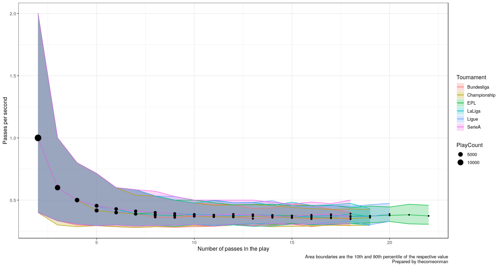
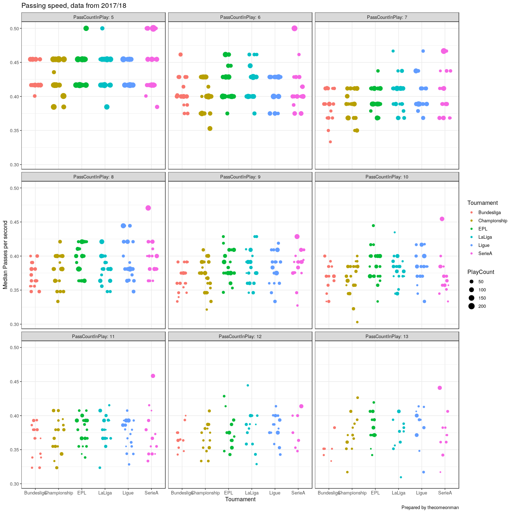
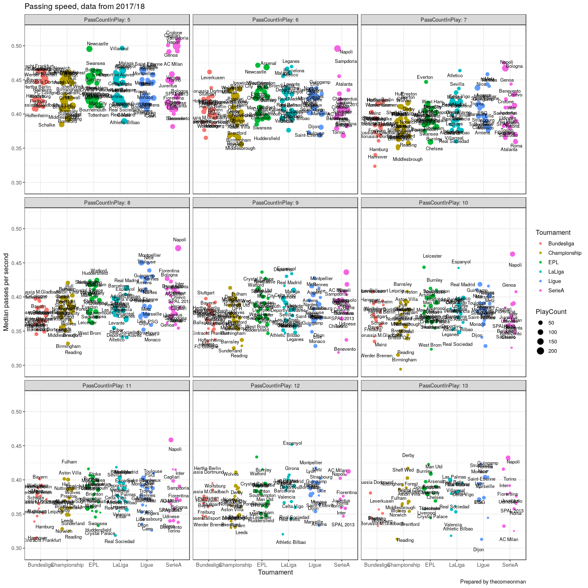
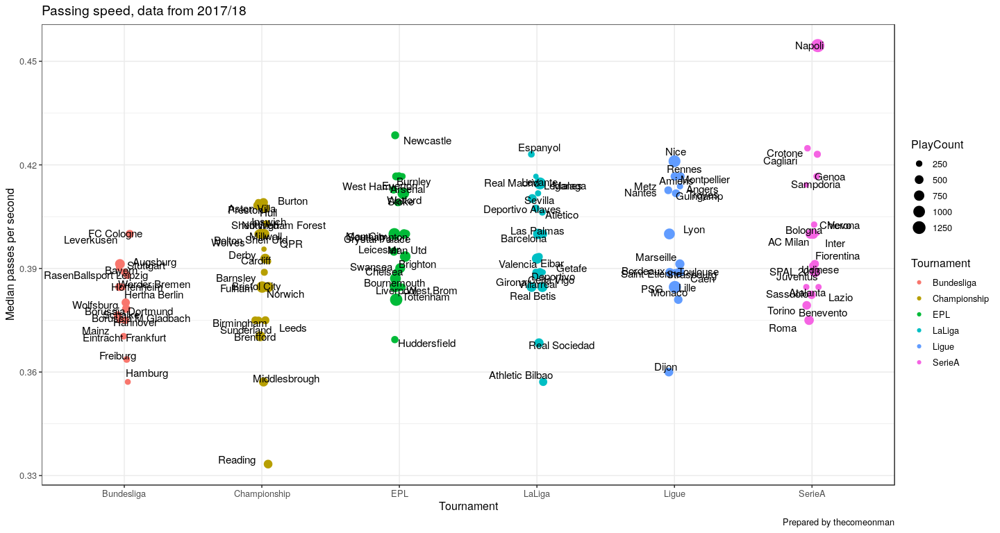

Someone on the internet was repeating the EPL being very fast and
players might struggle to cope with it, etc. spiel. I've been playing
with some passing data over
<a href = "https://thecomeonman.github.io/SpatialSimilaritiesBetweenPlayers/index.html">here</a>
and thought I'd take a quick look at whether the passing reflects this
statement or not.

( Unfortunately, the resolution to time in my dataset is only a second
so some precision is lost. )

Across leagues, the passing rate tends to settle at nearly the same
value of a little lesser than 0.4 passes per second. The EPL doesn't
look very different from the other leagues.

Since the rate tends to settle after a play of 5 passes or longer, I've
only included plays of 5 passes or longer in the below charts. I also
chopped off the data after plays of 13 passes because data was very
scarce there. The points plotted satisfy some minimum criterion of
number of plays with that many passes because otherwise the median would
be very skewed.

When we split the data further into teams -

Each point is the median passing rate for the respective team. Each box
is the number of passes in the play.

Based on this chart, the EPL might be sliiiiightly faster than the other
5 leagues. The Bundesliga clearly looks the slowest though.

For the fun of it, I'm going to dig a little deeper. Adding labels to
the previous charts to be able to discern the teams -

It's a little too cluttered. I'll combine all the plays of differing
passing lengths, to make it easier to consume -

Sarri's Napoli heads and shoulders above everybody else. Reading looking
the worst of them all.

The difference between Napoli and the overall median is probably lesser
than one extra pass every ten seconds though. That's all it takes for us
to perceive Sarriball as high tempo football.
